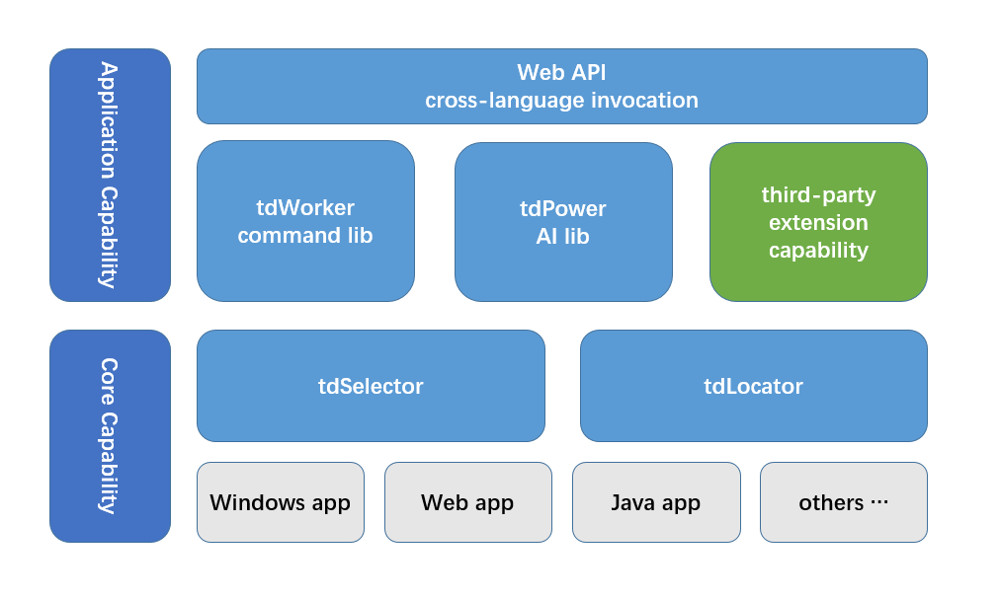

# tdRPA

*Read this in other languages: [中文](./README_cn.md) [English](./README.md)*

Support Python 3.8~3.12 with Windows x64([Except for 3.8.1](https://github.com/yinkaisheng/Python-UIAutomation-for-Windows))

## 1. What is tdRPA
tdRPA is an RPA SDK for software developers. Developers can use their familiar languages and development tools to develop new RPA applications or integrate RPA functionality into existing systems

## 2. System Components

- tdSelector: An element picker that visually picks UI elements and generates element lookup expressions
- tdLocator: Element locator, used to locate the corresponding UI element based on the element search expression generated by tdSelector. After locating the UI element, you can freely access and call its properties and methods
- tdWorker： Encapsulates common tasks into simple commands for direct invocation; simplifies RPA workflow creation, improves development efficiency, and ensures more stable, reliable, and maintainable processes
- tdPower： Encapsulates common AI capabilities (TBD)
- Third-party Extension Capabilities: Drives tech innovations and builds a developer and commercial ecosystem

## 3. tdRPA Features
|**Most RPA Suite**   |  **tdRPA** |
| ------------ | ------------ |
|Low-code platform, aimed at business users|SDK, aimed at professional software developers|
|Integrated Development Environment, all-in-one|Focus only on UI automation operations|
|Cannot be packaged as a standalone executable for distribution and deployment|Can be|
|Not easy to integrate as a software module into existing application systems|Easy|
|Proprietary visual designer combined with embedded code functionality|Use familiar programming languages and development tools|
|Code functionality, specific or limited programming languages|Python module, can also be called by other languages|
|Visual programming, low efficiency, chaotic and dizzying|Code-based, precise and flexible|
|Poor version management|Good|

## 4.Download and Installation
### tdSelector: No installation required, just unzip the file
- github [https://github.com/tdRPA/tdRPA/releases](https://github.com/tdRPA/tdRPA/releases)
- gitee [https://gitee.com/tdRPA/tdRPA/releases](https://gitee.com/tdRPA/tdRPA/releases)
### tdWorker
- installation `pip install tdrpa.tdworker`
- [document](https://gitee.com/tdworker/command/wikis/pages)

## 5. Usage
- [code](./demo)
- [video](https://space.bilibili.com/27639838/lists/2460456)

## 6. Update
- [Release Notes](./release)

## 7. Additional idea
- tdRPA is currently at v1.2, with full support for Windows applications and web applications. Support for other applications (e.g., Java, SAP) will be added in the future based on demand
- All core features are completely free for both personal and commercial use, with no restrictions. However, tdWorker and tdPower require a paid license. Third-party extensions may be free or paid, depending on the developer's policy
- We welcome feature requests! Your feedback will help us improve the product in a demand-driven manner

## 8. Similar Products
- Commercial,costly: UiPath,Blue Prism,Automation Anywhere,Pega,Microsoft Power Automation,UiBot,Cyclone
- Open Source,most without visual UI element selector: TagUI,Robot Framework,OpenRPA,UI.Vision,UiAutomation,Playwright

## 9. Milestones
|**Function**   |  **Status** |
| ------------ | ------------ |
|Windows applications| Completed |
|Web applications| Completed |
|Java applications| Under research |
|SAP applications| TBD |
|Mobile applications| TBD |
|Linux applications| TBD |

## 10. Technical Topics
- [FAQ](./topic/faq.md)
- [Usage demonstration](./topic/demo.md)
- [Invoked by other languages](./topic/interop.md)
- [Remote invocation, group control](./topic/rpc.md)
- [About chrome force-renderer-accessibility](./topic/chrome.md)
- [Related libraries, tools](./topic/toolset.md)

## 11. Contact
- Email: thingswell@qq.com
- WeChat: haijun-data

## 12. Support me
[wechat/alipay](./topic/zan.md)