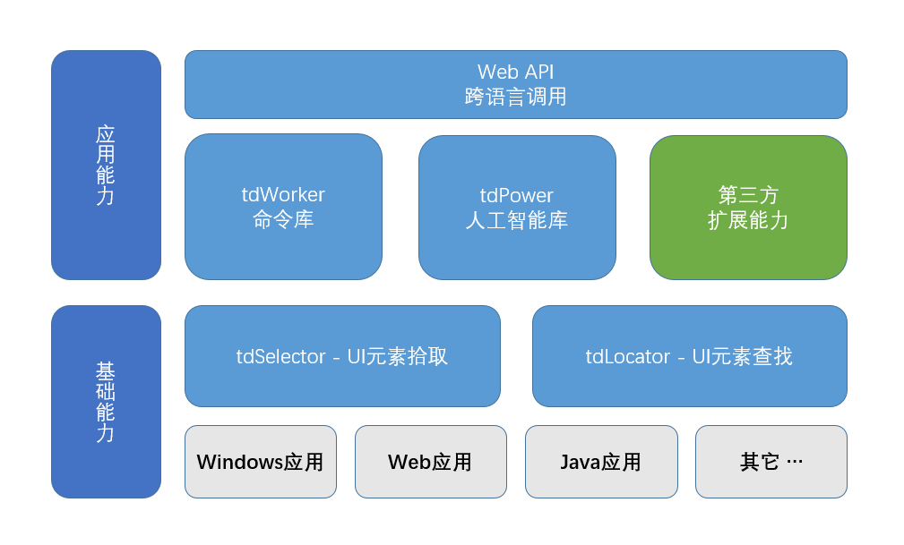

# tdRPA

*Read this in other languages: [中文](./README_cn.md) [English](./README.md)*

支持Python 3.8~3.12 with Windows x64([3.8.1除外](https://github.com/yinkaisheng/Python-UIAutomation-for-Windows))

## 1. tdRPA是什么
tdRPA是面向软件开发人员的RPA SDK，开发人员可以用自己熟悉的语言和开发工具，开发新的RPA应用，或把RPA功能集成到现有系统里

## 2. 系统组件

- tdSelector： 元素拾取器，可视化方式拾取UI元素，并生成元素查找表达式
- tdLocator： 元素定位器，根据tdSelector生成的元素查找表达式，定位到对应的UI元素，随后就可以随意访问调用UI元素的属性和方法
- tdWorker： 常见任务封装成简单的命令供直接调用，简化RPA流程的创建、提高开发效率、且流程更加稳定可靠易于维护
- tdPower： 封装常用AI能力，TBD
- 第三方扩展能力： 促进技术创新，构建开发者和商业生态

## 3. tdRPA的特点
|**大多数RPA应用**   |  **tdRPA** |
| ------------ | ------------ |
|低代码平台、面向业务人员|SDK、面向专业软件开发者|
|集成开发环境、大而全|只聚焦UI自动化操作|
|不能单独打包成可执行文件分发部署|可以|
|不容易作为软件模块集成到现有应用系统里|方便|
|专有可视化设计器结合嵌入代码功能|用自己熟悉的语言和开发工具|
|代码功能、特定或有限的编程语言|Python模块，也可被其它语言调用|
|可视化编程、效率低、手忙脚乱眼昏花|代码方式、精准灵活|
|版本管理不方便|方便|

## 4.下载安装
### tdSelector： 无需安装解压即可
- github [https://github.com/tdRPA/tdRPA/releases](https://github.com/tdRPA/tdRPA/releases)
- gitee [https://gitee.com/tdRPA/tdRPA/releases](https://gitee.com/tdRPA/tdRPA/releases)
### tdWorker
- 安装 `pip install tdrpa.tdworker`
- [文档](https://gitee.com/tdworker/command/wikis/pages)

## 5. 使用
- [代码示例](./demo)
- [视频课件](https://space.bilibili.com/27639838/lists/2460456)

## 6. 成功案例
- TBD
- TBD

## 7. 说明
- tdRPA目前是v1.2版本，已全面支持Windows应用和Web应用，其它应用(如Java、SAP)后续会根据需要增加支持
- 不论个人应用还是商业应用，基础能力全部免费，无任何限制；tdWorker和tdPower需付费使用；第三方扩展能力是否收费由开发方自行决定
- 欢迎提供应用需求，用需求驱动方式逐步完善产品

## 8. 类似产品
- 商业、价格高: UiPath、Blue Prism、Automation Anywhere、Pega、微软Power Automation、来也UiBot、影刀、金智维、艺赛旗、弘玑、Cyclone弘玑
- 开源、大多没有可视化元素拾取: TagUI、Robot Framework、OpenRPA、UI.Vision、UiAutomation、Playwright

## 9. 里程碑
|**功能**   |  **状态** |
| ------------ | ------------ |
|Windows应用| 已完成 |
|Web应用| 已完成 |
|Java应用| 研究中 |
|SAP应用| 待定 |
|移动应用| 待定 |
|Linux应用| 待定 |

## 10. 技术问题
- [FAQ](./topic/faq_cn.md)
- [使用演示](./topic/demo_cn.md)
- [被其它语言调用](./topic/interop_cn.md)
- [远程调用、群控](./topic/rpc_cn.md)
- [关于chrome force-renderer-accessibility](./topic/chrome_cn.md)
- [相关类库、工具](./topic/toolset_cn.md)

## 11. 联系
- mail: thingswell@qq.com
- 微信: haijun-data，加好友后可进tdRPA群交流

## 12. 捐赠
[微信/支付宝](./topic/zan.md)